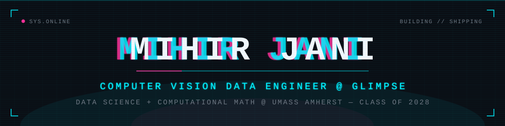
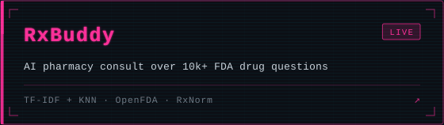
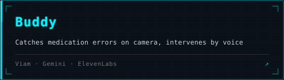
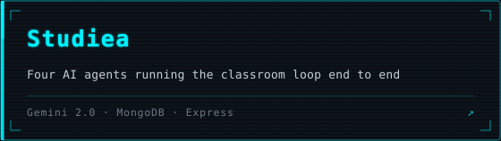
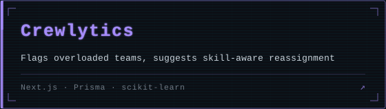
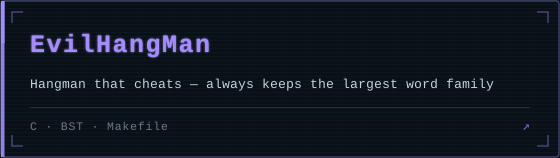
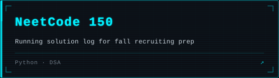
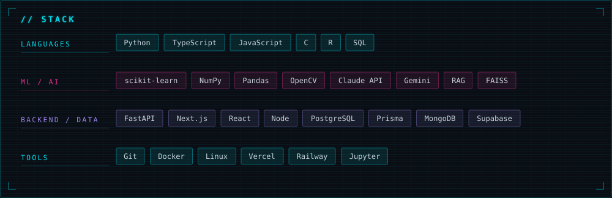
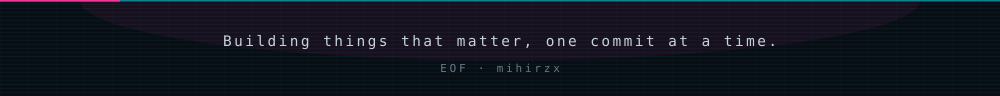

   

**Data Science & Computational Mathematics @ UMass Amherst, class of 2028.** I build machine learning systems that survive contact with production — right now that's battery quality-control computer vision as a CV Data Engineer Intern at **Glimpse**. Outside of it: lifting, climbing, UFC, and grinding NeetCode for fall recruiting.

## Projects

 

 

 

## Contributions

